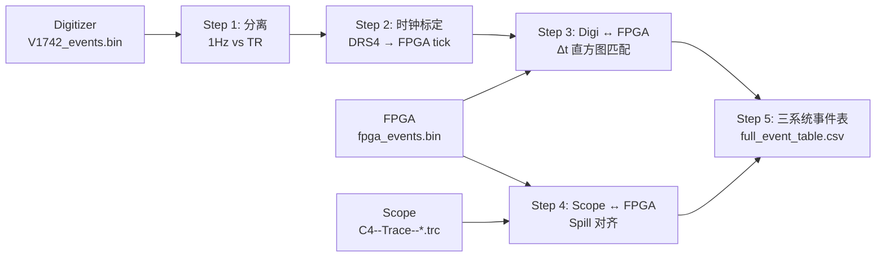

# Match-BeamTest-Data

三探测器（Digitizer V1742 — FPGA — LeCroy 示波器）束流测试数据时间戳匹配流水线。

## 目录结构

```
Match-BeamTest-Data/
├── README.md
├── src/data/                         # 核心数据 I/O 模块
│   ├── raw_data_recorder.py          #   V1742 Digitizer 二进制事件加载
│   └── fpga_parser.py                #   FPGA 16B 数据包解析
├── scripts/
│   ├── analyze_lecroy_wfm.py         # LeCroy .trc 文件解析 (Sequence 模式)
│   ├── match_timestamps.py           # 三系统全匹配 (独立版本)
│   └── match/                        # 匹配流水线子步骤
│       ├── run_pipeline.py           #   ★ 主流水线 (Step 1-5 一键运行)
│       ├── run_pipeline_run6.py      #   主流水线 (run_0006 变体)
│       ├── run_pipeline_run18.py     #   主流水线 (run_0018 变体)
│       ├── run_match.py              #   Step 1: 分离 1Hz 校准 / 物理触发
│       ├── digi_fpga_matching.py     #   Step 2: DRS4 → FPGA 时钟标定
│       ├── digi_fpga_matching_v2.py  #   Step 2 改进版 (逐事件最近邻)
│       ├── step3_match_by_spill.py   #   Step 3: Digi ↔ FPGA 按 Spill 匹配
│       └── step4_match_scope_fpga.py #   Step 4: Scope ↔ FPGA Spill 对齐
├── docs/algorithm/
│   ├── timestamp_matching.md         # 时间戳匹配算法文档
│   └── scope_fpga_spill_matching.md  # Scope-FPGA Spill 匹配文档
├── _make_three_plots.py             # 时序对齐可视化 (三面板)
└── _plot_spill_compare.py           # FPGA vs Scope Spill 对比图
```

## 流水线概览



### 匹配策略

| 步骤 | 内容 | 方法 |
|------|------|------|
| **Step 1** | 分类 Digitizer 事件 | TR 通道(32-35) tail−baseline 差异 > 5 ADC = 物理触发 |
| **Step 2** | 时钟域转换 | 用 1Hz GSYNC 脉冲做 DRS4 → FPGA tick 分段线性映射 |
| **Step 3** | Digi ↔ FPGA 匹配 | 全局 Δt 直方图峰值找偏移 → 3σ 窗口内最近邻匹配 |
| **Step 4** | Scope ↔ FPGA 匹配 | 展开示波器 Sequence → 按 Spill (Δt>50ms) 对齐 → RMS 验证 |
| **Step 5** | 三系统合并 | 以 FPGA trigger_id 为主键，关联 Scope + Digi，输出 CSV |

## 快速开始

### 环境要求

```bash
pip install numpy matplotlib lecroyparser
```

### 运行

1. 准备数据目录 (需包含三个子目录):

```
BT_YYYYMMDD_HHMMSS-run_XXXX/
├── digitizer/V1742_events.bin
├── fpga/fpga_events.bin
└── lecroy_wfm/C4--Trace--*.trc
```

2. 修改 `scripts/match/run_pipeline.py` 中的 `RUN` 路径:

```python
RUN = str(REPO.parent / 'Analyze' / 'data' / '你的数据目录')
```

3. 运行:

```bash
python scripts/match/run_pipeline.py
```

### 输出

- **事件表**: `{RUN}/temp/full_event_table.csv` — 三系统完整事件关联表
- **匹配图**: `plots/step1_classify.png` ~ `step4_spill_rms.png`
- **中间文件**: `{RUN}/temp/corrected_timetags.npz`, `matched_pairs.npz`

## CSV 输出字段

| 字段 | 说明 |
|------|------|
| `fpga_trigger_id` | FPGA 触发 ID (主键) |
| `fpga_tick` | FPGA 时间戳 (200MHz ticks) |
| `has_scope` | 是否有示波器匹配 (0/1) |
| `scope_file_idx` | 示波器文件索引 |
| `scope_seg_idx` | 示波器段索引 |
| `has_digi` | 是否有 Digitizer 匹配 (0/1) |
| `digi_evnum` | Digitizer 事件号 |
| `digi_tt_raw` | Digitizer 原始 trigger_time_tag |
| `digi_is_1hz` | 是否为 1Hz 校准事件 |
| `dt_ns` | Digi−FPGA Δt (ns) |

## 关键技术参数

| 参数 | 值 |
|------|-----|
| Digitizer 型号 | CAEN V1742 (X742) |
| DRS4 采样周期 | 8.5 ns (~117.6 MHz) |
| FPGA 时钟 | 200 MHz (5 ns/tick) |
| FPGA 1Hz 实测 | 200,000,020 ticks |
| TR 通道 | 32, 33, 34, 35 |
| Spill 间隔阈值 | 50 ms |

## run_0018 匹配效果 (示例)

| 指标 | 值 |
|------|-----|
| Digitizer 总事件 | 13,033 |
| 物理触发 (非1Hz) | 11,840 |
| Digi ↔ FPGA 匹配率 | **99.5%** (11,777/11,840) |
| Δt 分辨率 σ | **1.2 ticks ≈ 6 ns** |
| Scope ↔ FPGA Spill 对齐 | **RMS = 0** (80 个 Spill 全部完美匹配) |
| 三系统重合事件 | **11,612** |
